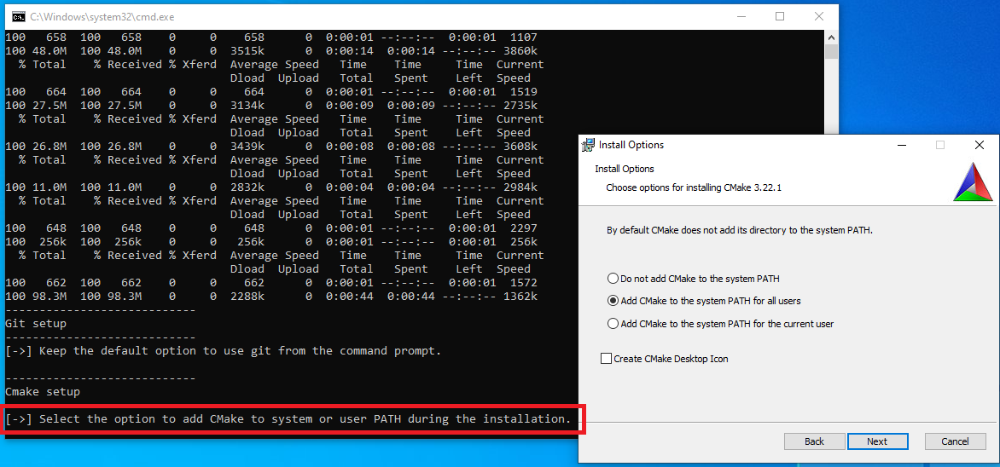
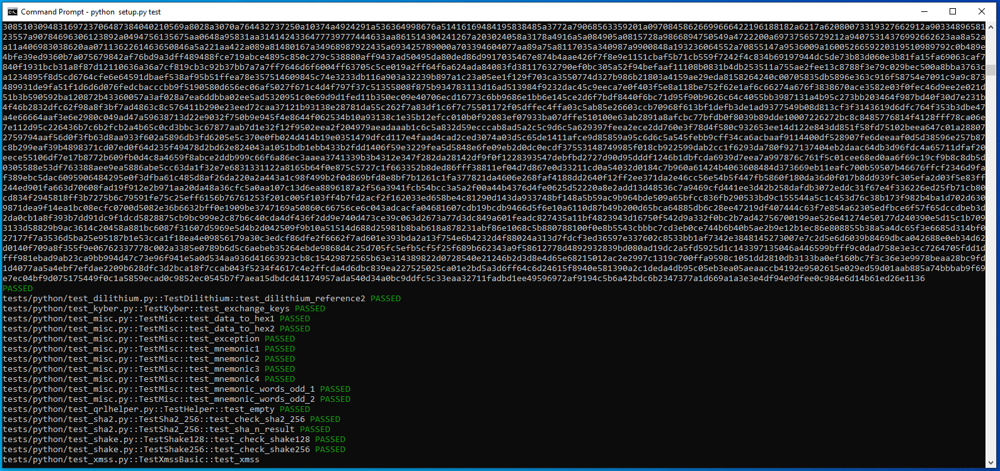

# Windows native support for the QRL Core Library

The [QRL](https://www.theqrl.org/) Core Library is currently not supported by Windows. Related issues are: [qrllib#38](https://github.com/theQRL/qrllib/issues/38), [qrl#306](https://github.com/theQRL/QRL/issues/306) and [qryptonight#31](https://github.com/theQRL/qryptonight/issues/31).

This project is a PoC developped during the [QRL Winter Hackathon 2021](https://www.theqrl.org/blog/qrl-winter-hackathon-2021/). This PoC was tested on Windows 10. 

## Qrllib setup

1) (Optional) Before launching the setup, it is recommended to disable UAC. UAC has a timeout of two minutes. If no acknowledgment is received within those two minutes, the action fails silently (same as if you would have declined).

2) Run *Install_qrllib_Windows.bat.* Follow the instructions for the requirements. 

  

3) When you’re done, you can perform a final test:
	
		C:\src\qrllib>python setup.py test
	 

  

## Next steps

Qrllib should be ready to use. 

Note that environment variable used are not permanent. If needed to compile something else:

		set PATH=%PATH%;C:\msys64\usr\bin;
		set PATH=%PATH%;C:\msys64\mingw64\bin;
		set PATH=c:\opt\bin;c:\opt\swigwin;%PATH%
		set CC=gcc
		set CXX=g++
